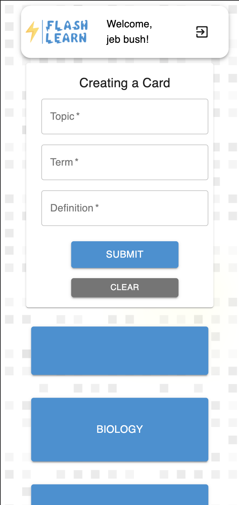
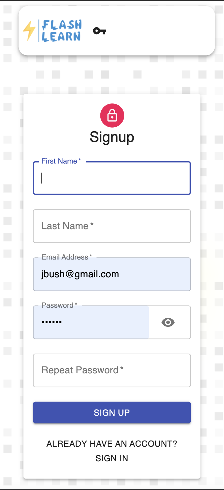
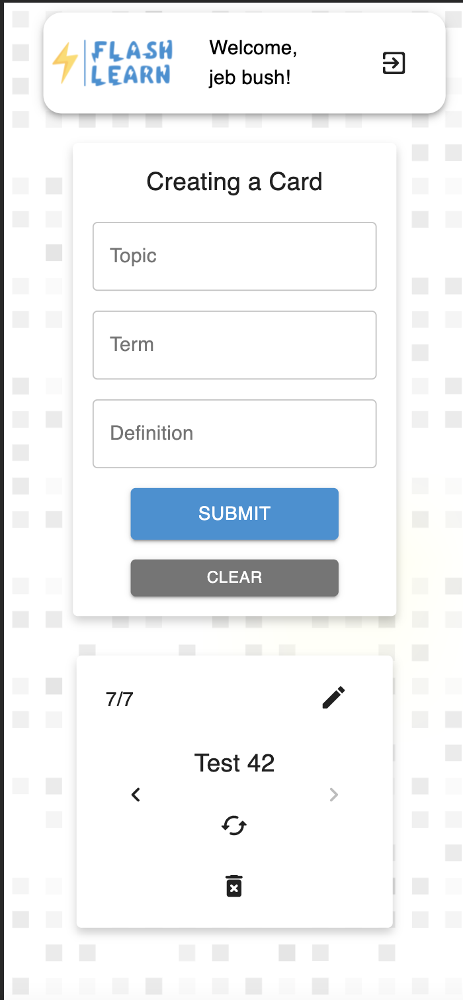
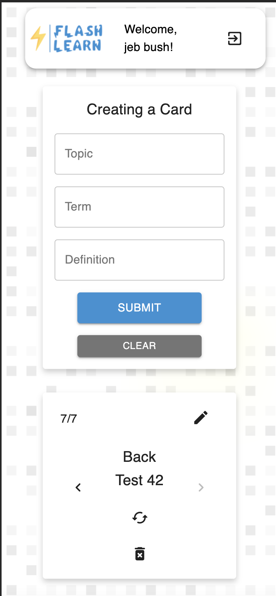

# Flash_Learn

## Description 
Flash Learn is an educational application for students to make flash cards and quiz themselves to develop better vocabulary. 

## Access
You can access the application [here](https://ancient-dawn-05615.herokuapp.com/auth)

## Use
Going to the website, you will be greeted with this screen 

If you do not have an account, you can click the link at the bottom of the form and you will be taken to a page that looks like this. 

Once logged in, you will be greeted to a home page.

You can enter information to make a new card, if the topic is the same as one that already exists, you will not see a new topic pop up.  But when you click on a topic card, it will redirect you to a page to quiz yourself.  On this page you can flip cards.  The image below shows the front of a card.

Clicking the icon below the term will flip the card over to the back. 

## Contributions
I'd like to thank Brandon Max and Paal Williams for their guidance on this project.  They were a huge help to me and teaching more about React js.  

## Future Development
- Keep track of correct and incorrect cards
- Provide users a summary of what they need to study after a session of using flashcards. 
- Sharing flashcards with other users.
- Searching for publicly availble flashcards. 
- .csv file input to ingest flshcards in bulk.  
- Adding images to cards for pictoral representations. 

## Summary
This project was an opportunity to dive into the React framework.  This was difficult at first, but over time I felt like I learned a lot about managing state.  
